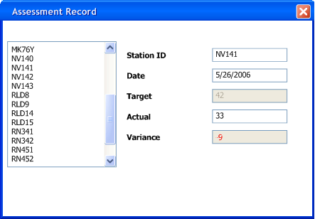

# GUI 架构
[原文: GUI Architectures By Martin Fowler](https://martinfowler.com/eaaDev/uiArchs.html)

*有许多不同的方式去组织富客户端代码。这里我将讨论部分我觉得已经极具影响的，并介绍它们如何与模式关联*

用户图形界面已经是软件中常见的一部分，无论对于用户还是开发者。从设计的角度来看，它们在系统设计中代表了一类特殊的问题，这些问题导致了一系列不同但相似的解决方案。

我关注的是为应用开发者找到通用及有用的模式，并能够将其用在富客户端的开发中。在项目回顾中我看到了许多不同的设计，并且各种各样的设计以一种固定的方式在使用。在这些设计中是有用的模式，但如何描述这些模式却不容易。以 Model-View-Controller 为例，它经常被看作为模式，但我不认为这很有帮助。因为把 Model-View-Controller 看作为模式会使它涵盖太少不同的观点。不同的人在不同的地方看到`MVC`时，会从中得到不同的观点。如果这还没有使你感到困惑，说明你已经深受误解`MVC`的影响。

在这篇短文中我要探讨一些有用的架构，并描述我理解的其中最有用的特征。我希望这能提供一个理解我描述的模式的背景。

在一定程度上，你可以把这边短文看作是追溯这些年`UI`设计在不同架构中的思想史。关于这点，我必须要警告一下。理解架构是不易的，尤其是当它们中的许多已经放生改变或已造弃用。追寻思想的传播更加困难，因为人们能够在同一个架构中读取到不同的信息。尤其是我没有对我描述的架构做详细的调查。我只是查看了这些设计的通用描述。如果这些描述漏掉是什么，那我也不会知道。所以不要把我的描述最为权威。此外，我不考虑或简单描述一下内容，如果我认为它们是不重要的。记住，我主要的关注点是设计之下的模式，不是它们的历史。

(有一例外：我确实通过一个运行的Smalltalk-80去调查`MVC`。再次强调，我不会详细的描述我的调查结果。但它确实揭示了无法通过对`MVC`有一个通用的描述。这令我在描述其他架构时更加小心。如果你对其中任何架构熟悉，并觉得我错误或错过一些重要的信息，请告知我。我同时也认为在这领域中，一个更详细的调查会是一不错的学术研究。)

## Forms and Controls
我以一个简单常见的架构开始我对架构的研究。它没有一个通用的名字，在这里我给它取名`Forms and Controls`。它是一个常见的架构，因为它在90年的客户端-服务器开发环境中，如`Visual Basic`，`Delphi`，`Powerbuilder`这样的工具，被鼓励使用。尽管它会被想我这样的设计极客贬低，但它依然经常被采用。

要研究`Forms and Controls`，以及其他的架构，我会使用一个通用的例子：在我居住的新英格兰，有一个监控大气中冰淇淋颗粒的数量的政府程序。如果含量太低，就表明我们没有吃足够的冰淇淋，这会对经济和公共秩序造成严重风险。（我喜欢使用像这篇文章中的真实的(no less realistic)例子。）

为了监控冰淇淋的健康程度，政府在全新英格兰州设立了一系列监控站。部门使用复杂的大气模型对每一处监控站设置了一个目标值。每隔一段时间工作人员到各个监控站记录实际的冰淇淋颗粒含量进行评估。这个界面可以让工作人员选择一个监控站，输入日期和实际值。然后系统对目标值计算出一个差异值。系统会对小于等于目标值10%的差异值显示红色，对大于等于5%的差异值显示绿色。

 
*图1：我所使用的用户界面的例子*

就像图片显示的，我们把一个重要的划分放在了一起：表单是特定于我们应用的，但它使用的控件是通用的。大多数的`GUI`环境都提供大量的可以在应用中使用的通用控件。我可以创建新的控件，而且也经常需要这么做。但普通可重用的控件和特定的表单还是不同的。即使编写的特殊控件也需要在不同的表单中重用。

表单包含两个主要职责：
* 屏幕布局：定于控件在屏幕上的排列，以及他们之间的层级结构。
* 表单逻辑：不能容易的在空间中编码的行为。

大多数的`GUI`开发环境允许开发者使用图形编辑器通过拖拽，删除控件到表单中来定义屏幕布局。这几乎处理了表单的布局。通过这种方式能够很容易的在表单上建立一个令人满意的布局（尽管它不总是最好的方式-我们稍后在讨论这个问题）。

控件展示数据，这里就是我们的数值读数。数据经常来源于其他地方，这里我们假设是数据库，因为数据库环境是大多数这些客户端-服务器工具假设使用的。通常情况下会涉及到三分数据拷贝：
* 一份数据拷贝在数据库中。这份数据是持久记录的数据，所以我称它为记录状态(record state)。记录状态被共享，并对不同的人以不同的方式可见。
* 另一份数据拷贝在应用程序的存储于内存中的[Record Sets](https://martinfowler.com/eaaCatalog/recordSet.html)。许多客户端-服务器环境都提供工具来完成这些工作。这些数据只与应用与数据库之间的特定回话有关，所以我叫它回话状态(session state)。基本上它提供了一份临时的本地版本的数据，用户可以操作它们，直到它们被保存、提交回数据库，并于记录状态合并。这里我并不关心记录状态与回话状态的协调问题，我在[P of EAA](https://martinfowler.com/books.html#eaa)中介绍了不同的技术来解决这个问题。
* 最后一份数据在`GUI`组件中。确切地说，就是在屏幕上看见的数据，因此我叫它屏幕状态(screen state)。如何在`UI`上保持屏幕状态与回话状态的同步是非常重要的。

保持屏幕状态与回话状态的同步是一项重要的任务。一种能帮助我们更轻松的完成这项认为的工具是`Data Binding`。它的思想是：当有任何有对控件数据，或它以来的记录集(record set)的改变，就会迅速的传播的另一方。所以，如果我在屏幕上修改了实际值读数，文本框控件就会迅速的修改对应的记录集中正常的列。